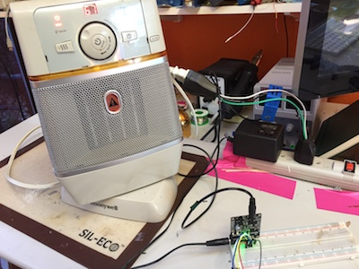

# CircuitPython for the Single Phase Energy Monitor
__TODO__: I did not implement all the mehods/properties that are in the Arduino port.  I am hoping through Open Source that someone (you?) would like to add more.  

# Thanks to Those that went Before
There is _so much_ prior work that made it easier to write a CP library for the atm90e32.  Efforts include:  
* Tisham Dhar's [atm90e26 Arduino library](https://github.com/whatnick/ATM90E26_Arduino).    
* The [atm90e26 Circuit Python library I wrote](https://github.com/BitKnitting/HappyDay_ATM90e26_CircuitPython)  
* Circuit Setup's [atm90e32 Arduino library](https://github.com/CircuitSetup/Split-Single-Phase-Energy-Meter/tree/master/Software/libraries/ATM90E32)
# What the Code Does
We can write [Circuit Python](https://github.com/adafruit/circuitpython) instead of Arduino IDE to talk to the atm90e32. 
Here's an [example](examples/CP_ATM90E32_Basic_SPI.py):  
```
import digitalio
import board
import busio

from atm90e32 import ATM90e32
from adafruit_bus_device.spi_device import SPIDevice
# ***** CALIBRATION SETTINGS *****/
# These settings work for my setup: 
# - the SCT-013-000 CT 
# - house in North America.
# - using a 9V AC Transformer.
# ********************************/

lineFreq = 4485             # 4485 for 60 Hz (North America)
                            # 389 for 50 hz (rest of the world)
PGAGain = 21                # 21 for 100A (2x), 42 for >100A (4x)

VoltageGain = 42080         # 42080 - 9v AC transformer.
                            # 32428 - 12v AC Transformer

CurrentGainCT1 = 25498      # 38695 - SCT-016 120A/40mA CT
CurrentGainCT2 = 25498      # 25498 - SCT-013-000 100A/50mA CT
                            # 46539 - Magnalab 100A w/ built in burden resistor

###########################################################
# Initialize SPI and grab an instance of the ATM90e32 class.
###########################################################
spi_bus = busio.SPI(board.SCK, MISO=board.MISO, MOSI=board.MOSI)
cs = digitalio.DigitalInOut(board.D10)
energy_sensor = ATM90e32(spi_bus, cs, lineFreq, PGAGain,
                         VoltageGain, CurrentGainCT1, 0, CurrentGainCT2)
###########################################################
# Hello, hello...can you hear me??
###########################################################
sys0 = energy_sensor.sys_status0
if (sys0 == 0xFFFF or sys0 == 0):
    print('ERROR: not receiving data from the energy meter')
############################################################
# Print out the amount of power being used.
############################################################    
print('Active Power: {}W'.format(energy_sensor.active_power))
############################################################
# Print out voltage, current, and frequency readings.
############################################################
print('Voltage 1: {}V'.format(voltageA))
print('Voltage 2: {}V'.format(voltageC))
print('Current 1: {}A'.format(energy_sensor.line_currentA))
print('Current 2: {}A'.format(energy_sensor.line_currentC))
print('Frequency: {}Hz'.format(energy_sensor.frequency))
```
# Sending and Receiving SPI
[atm90e32.py](src/atm90e32.py) provides the ATM90e32 class.  It's job is to abstract the register names into "easy to understand" properites (such as the ```active_power``` property).  Then send and receive bytes over SPI in a way that the atm90e32 understands.

Writing this library was easy because of [Circuit Setup's Arduino code](https://github.com/CircuitSetup/Split-Single-Phase-Energy-Meter/tree/master/Software/libraries/ATM90E32).  Given python's strength in string manipulation, I was able to write [a simple script](arduino_to_python/register_from_ard_to_py.py) that converted the Arduino [ATM90E32.h](https://github.com/CircuitSetup/Split-Single-Phase-Energy-Meter/blob/master/Software/libraries/ATM90E32/ATM90E32.h) to an equivalent file I could use with CircuitPython.
# Example Output
After running the code within the Mu editor, the results were:  
```
Sys status:  S0:0x370   S1:0x2a0c
meter status E0: 0x300 S1:0x220c
Last SPI read: 0x220c
Voltage 1: 119.21V
Voltage 2: 107.95V
Current 1: 9.903A
Current 2: 0.012A
Frequency: 59.98Hz
Active Power: 1168.84W
```
Here is my setup:  
